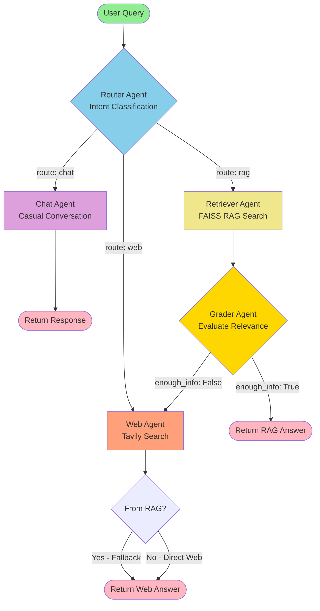
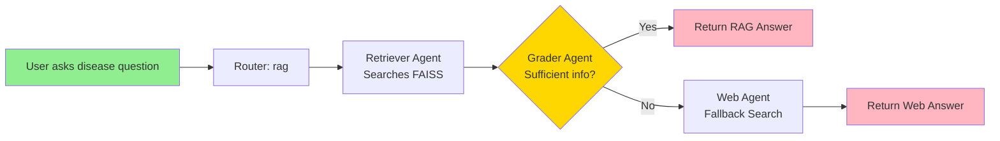

# 🤖 LangGraph Agent Flowchart

## Overview

This document describes the agentic workflow built with LangGraph for the Neuro Leaf chatbot system. The graph intelligently routes user queries to specialized agents based on intent classification.

---

## 🔄 Complete Agent Flow



---

## 📋 Agent Descriptions

### 1. Router Agent
**File**: `agents/router_agent.py`  
**Purpose**: Intent classification and query routing

**Classification Logic**:
- **chat**: Greetings, casual conversation, or questions about already-detected disease in system context
- **rag**: Tomato plant disease knowledge (symptoms, causes, treatments, prevention)
- **web**: Out-of-domain queries (non-agriculture topics)

**Hard Rules**:
1. If system context mentions detected disease → prefer `chat`, NOT `web`
2. Questions about disease name, symptoms, treatment → route to `rag`
3. Greetings or meta-questions → route to `chat`
4. Only route to `web` for non-plant topics (e.g., human health, finance, weather)

**Output**: Sets `state["route"]` to `"chat"`, `"rag"`, or `"web"`

---

### 2. Chat Agent
**File**: `agents/chat_agent.py`  
**Purpose**: Handle casual conversation and contextual disease questions

**Behavior**:
- Friendly assistant persona
- Uses full message history including system context (with detected disease info)
- Generates natural conversational responses
- Sets `state["final_answer"]` with response content

**Direct to**: END (returns response immediately)

---

### 3. Retriever Agent (RAG)
**File**: `agents/retriever_agent.py`  
**Purpose**: Retrieve relevant knowledge from FAISS vector store

**Process**:
1. Uses `retriever_tool` with tool-calling pattern
2. Searches FAISS index built from PDF documents in `context/`
3. Retrieves top-k relevant document chunks
4. Stores results in `state["retrieved_docs"]`

**Tools Used**:
- `retriever_tool`: FAISS similarity search over tomato disease PDFs

**Next Step**: → Grader Agent (always)

---

### 4. Grader Agent
**File**: `agents/grader_answer_agent.py`  
**Purpose**: Evaluate if RAG context sufficiently answers the question

**Grading Logic**:
```python
if route == "rag":
    if context fully answers question:
        state["enough_info"] = True  → END (return RAG answer)
    else:
        state["enough_info"] = False → Web Agent (fallback)
```

**Conditional Routing**:
- `enough_info: True` → END (RAG answer is sufficient)
- `enough_info: False` → Web Agent (fallback to web search)
- `enough_info: None` → END (when coming from Web Agent directly)

**Answer Generation**:
- If sufficient: Generates final answer from retrieved RAG context
- Sets `state["final_answer"]` with response

---

### 5. Web Agent
**File**: `agents/web_agent.py`  
**Purpose**: Search the web for information using Tavily API

**Use Cases**:
1. **Direct routing**: When Router classifies query as `web`
2. **RAG fallback**: When Grader determines RAG context is insufficient

**Process**:
1. Uses `tavily_search_tool` with tool-calling pattern
2. Searches web for relevant information
3. Stores results in `state["web_retrievals"]`
4. Generates final answer from web results
5. Sets `state["enough_info"] = None` (skip grading for web results)

**Next Step**: → Grader Agent → END (no re-grading)

---

## 🔀 Routing Logic Summary

| Route | Condition | Agent | Can Fallback? |
|-------|-----------|-------|---------------|
| **chat** | Greetings, casual questions | Chat Agent | No → Direct to END |
| **rag** | Disease knowledge queries | Retriever Agent → Grader Agent | Yes → Web Agent if insufficient |
| **web** | Out-of-domain questions | Web Agent → Grader Agent | No → Direct to END |

---

## 🔄 Fallback Mechanism



**Example Scenario**:
1. User asks: *"What are the latest treatment methods for late blight?"*
2. Router → `rag`
3. Retriever searches PDFs → finds some info but dated
4. Grader evaluates → `enough_info: False`
5. **Automatic fallback** → Web Agent searches latest research
6. Web Agent returns updated treatment methods

---

## 📊 State Management

**AgentState Fields** (`agents/state.py`):

```python
class AgentState(TypedDict):
    question: str                    # Original user query
    messages: List[BaseMessage]      # Conversation history
    route: Literal["chat", "rag", "web"]  # Routing decision
    retrieved_docs: List[str]        # RAG retrieved documents
    web_retrievals: List[str]        # Web search results
    enough_info: bool | None         # Grader evaluation
    final_answer: str                # Generated response
```

**State Flow**:
1. **Router** sets `route` and preserves `messages`
2. **Chat Agent** updates `messages` and sets `final_answer`
3. **Retriever Agent** sets `retrieved_docs`
4. **Grader Agent** sets `enough_info` and `final_answer`
5. **Web Agent** sets `web_retrievals`, `enough_info = None`, and `final_answer`

---

## 🛠️ Tools Integration

### Retriever Tool
**File**: `tools/retriever_tool.py`  
**Function**: `retriever_tool(query: str) -> str`  
**Backend**: FAISS vector store with HuggingFace embeddings

### Tavily Search Tool
**File**: `tools/tavily_search_tool.py`  
**Function**: `tavily_search_tool(query: str) -> str`  
**Backend**: Tavily API for web search

---

## 🎯 Decision Matrix

| Query Type | Example | Router → | Next Agent | Grader? | Fallback? |
|------------|---------|----------|------------|---------|-----------|
| Greeting | "Hello!" | `chat` | Chat Agent | No | No |
| Disease Info | "What causes late blight?" | `rag` | Retriever | Yes | → Web if insufficient |
| Treatment | "How to treat bacterial spot?" | `rag` | Retriever | Yes | → Web if insufficient |
| Detection Context | "What is the disease you detected?" | `chat` | Chat Agent | No | No |
| Out-of-domain | "What's the weather today?" | `web` | Web Agent | No grading | No |
| Latest News | "Latest tomato disease research?" | `rag` → fallback | Retriever → Web | Yes | Likely fallback |

---

## 🔧 Configuration

### LLM Configuration
**File**: `core/llm.py`  
- Model: `openai/gpt-4o-mini` via OpenRouter
- Temperature: 0.0 (deterministic)
- Max Tokens: 1000

### Graph Compilation
**File**: `core/build_graph.py`  
- Graph Type: `StateGraph` with `AgentState`
- Entry Point: `router` node
- Compilation: `graph.compile()` → executable workflow

---

## 📈 Performance Considerations

### Router Optimization
- Fast intent classification (single LLM call)
- Fallback to `rag` if invalid route returned

### RAG Efficiency
- FAISS enables fast similarity search
- Retrieval before expensive LLM generation
- Context pre-filtering reduces token usage

### Fallback Strategy
- Automatic degradation from RAG to web
- Prevents "I don't know" responses
- Maximizes answer coverage

---

## 🧪 Testing Agent Flow

### Test Chat Route
```python
state = {"messages": [HumanMessage(content="Hi there!")], "question": "Hi there!"}
result = app.invoke(state)
# Expected: route="chat", direct to END
```

### Test RAG Route (Sufficient)
```python
state = {"messages": [HumanMessage(content="What causes early blight?")], "question": "What causes early blight?"}
result = app.invoke(state)
# Expected: route="rag", enough_info=True, answer from PDFs
```

### Test RAG Fallback
```python
state = {"messages": [HumanMessage(content="Latest quantum computing in agriculture")], "question": "Latest quantum computing in agriculture"}
result = app.invoke(state)
# Expected: route="rag", enough_info=False, fallback to web
```

### Test Web Route
```python
state = {"messages": [HumanMessage(content="Tell me about Python programming")], "question": "Tell me about Python programming"}
result = app.invoke(state)
# Expected: route="web", direct web search, skip grading
```

---

## 🚀 Future Enhancements

- [ ] Add **Confidence Scoring** to Router Agent
- [ ] Implement **Multi-hop Reasoning** for complex queries
- [ ] Add **Caching Layer** for repeated queries
- [ ] Integrate **Feedback Loop** for continuous improvement
- [ ] Add **Hybrid Search** (semantic + keyword)
- [ ] Implement **Query Rewriting** before retrieval
- [ ] Add **Source Citation** in final answers

---

## 📚 References

- LangGraph Documentation: https://langchain-ai.github.io/langgraph/
- LangChain Tool Calling: https://python.langchain.com/docs/modules/agents/tools/
- FAISS: https://github.com/facebookresearch/faiss
- Tavily API: https://tavily.com/

---

**Last Updated**: January 9, 2026  
**Maintained by**: Neuro Leaf Development Team
