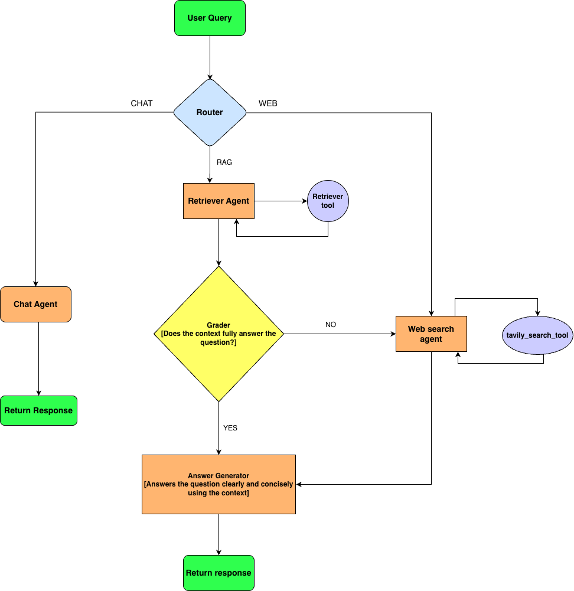

# 🤖 LangGraph Agent Flowchart

## Overview

This document describes the agentic workflow built with LangGraph for the Neuro Leaf chatbot system. The system features a **multi-agent architecture** that intelligently routes user queries to specialized agents based on intent classification, with built-in fallback mechanisms for comprehensive answer generation.

### Architecture Highlights

- **6-Agent Workflow**: Router, Chat, Retriever, Grader, Web Search, and Answer Generator
- **Intelligent Routing**: Intent classification routes queries to optimal agent paths
- **Fallback Mechanism**: Automatic degradation from RAG to web search for comprehensive coverage
- **Context-Aware**: Integrates disease detection context into conversation state
- **Production-Ready**: Session management, error handling, and state persistence

---

## 🔄 Complete Agent Flow



## 📋 Agent Descriptions

### 1. Router Agent

**File**: `agents/router_agent.py`
**Purpose**: Intent classification and query routing
**LLM Call**: 1 call per user query

**Classification Logic**:

- **CHAT**: Greetings, casual conversation, meta-questions, or disease-related questions in system context
- **RAG**: Tomato plant disease knowledge (symptoms, causes, treatments, prevention, management)
- **WEB**: Out-of-domain queries (non-agriculture topics, current events, general knowledge)

**Hard Rules**:

1. If system context contains detected disease → prefer `CHAT` unless asking for detailed treatment
2. Questions containing disease names, symptoms, treatment → route to `RAG`
3. Greetings or meta-questions ("How does this work?") → route to `CHAT`
4. Only route to `WEB` for non-plant, non-agriculture topics
5. If query is ambiguous → default to `RAG` (knowledge-seeking behavior)

**Output**:

- Sets `state["route"]` to `"CHAT"`, `"RAG"`, or `"WEB"`
- Preserves conversation `messages` for context awareness

---

### 2. Chat Agent

**File**: `agents/chat_agent.py`
**Purpose**: Handle casual conversation and contextual disease questions
**LLM Call**: 1 call per chat-routed query

**Behavior**:

- Friendly, conversational assistant persona
- Uses full message history including disease context from system state
- Generates natural, engaging responses
- No external tools needed (direct LLM generation)
- Sets `state["final_answer"]` with response content

**Context Awareness**:

- Receives detected disease info in system message
- Maintains conversation continuity with full message history
- Provides contextual disease guidance without formal retrieval

**Direct Path**: END (returns response immediately without fallback)

---

### 3. Retriever Agent (RAG)

**File**: `agents/retriever_agent.py`
**Purpose**: Retrieve relevant knowledge from FAISS vector store
**Tools**: `retriever_tool` (FAISS similarity search)

**Process**:

1. Uses tool-calling pattern to invoke `retriever_tool`
2. Queries FAISS index built from 10 PDF documents in `context/`
3. Retrieves top-k relevant document chunks (default k=4)
4. Stores results in `state["retrieved_docs"]`
5. Adds retrieved context to message history

**Retriever Tool Details** (`tools/retriever_tool.py`):

- **Backend**: FAISS vector store with `all-MiniLM-L6-v2` embeddings (384-dim)
- **Index Source**: 10 research papers covering tomato diseases
- **Search Type**: Semantic similarity search
- **Output**: Ranked document chunks with relevance scores

**Next Step**: → Grader Agent (always passes to evaluation)

---

### 4. Grader Agent

**File**: `agents/grader_answer_agent.py`
**Purpose**: Evaluate if RAG context sufficiently answers the user's question
**LLM Call**: 1 call for quality assessment

**Grading Logic**:

```
if retrieved_docs contain sufficient information:
    state["enough_info"] = True  
    → Answer Generator (use RAG context)
else if information is insufficient/incomplete:
    state["enough_info"] = False  
    → Web Agent (fallback search)
```

**Evaluation Criteria**:

- Does context directly address the user's question?
- Is the information recent and relevant?
- Are there specific details (not just general statements)?
- Does it cover practical/actionable aspects?

**Conditional Routing**:

- `enough_info: True` → Answer Generator (use RAG answer)
- `enough_info: False` → Web Agent (fallback to web search)

**Answer Generation** (if sufficient):

- Generates final answer synthesizing retrieved RAG context
- Cites sources from PDF documents
- Sets `state["final_answer"]` with polished response

---

### 5. Web Search Agent

**File**: `agents/web_agent.py`
**Purpose**: Search the web for current information using Tavily API
**Tools**: `tavily_search_tool` (web search)

**Use Cases**:

1. **Direct routing**: When Router classifies query as `WEB` (out-of-domain)
2. **RAG fallback**: When Grader determines RAG context is insufficient
3. **Supplementary**: Combines web results with incomplete RAG findings

**Process**:

1. Uses tool-calling pattern to invoke `tavily_search_tool`
2. Queries Tavily API for web results
3. Stores results in `state["web_retrievals"]`
4. Ranks and filters results by relevance
5. Integrates web results into message history

**Web Search Tool Details** (`tools/tavily_search_tool.py`):

- **Backend**: Tavily API
- **Query Optimization**: Automatically refines search queries for better results
- **Result Filtering**: Removes duplicates and irrelevant results
- **Output**: Top web search results with URLs and summaries

**Next Step**: → Answer Generator (synthesize web + optional RAG results)

---

### 6. Answer Generator

**File**: Built into agent nodes (implicit synthesis step)
**Purpose**: Generate final response from all available sources
**LLM Call**: 1 call for response synthesis

**Input Sources**:

- Original user question
- Retrieved RAG documents (if applicable)
- Web search results (if applicable)
- Full conversation history
- System context with disease info

**Response Generation**:

- Synthesizes all available information into coherent answer
- Prioritizes accuracy and relevance
- Includes source citations where appropriate
- Maintains conversational tone
- Structures complex answers clearly

**Output**:

- Sets `state["final_answer"]` with final response
- Returns response to FastAPI endpoint
- Endpoint returns to user via Streamlit frontend

---

## 🔀 Routing Logic Summary

| Route          | Condition                                | Primary Agent   | Tools              | Grader | Fallback                     |
| -------------- | ---------------------------------------- | --------------- | ------------------ | ------ | ---------------------------- |
| **CHAT** | Greetings, casual, meta-questions        | Chat Agent      | None               | No     | None                         |
| **RAG**  | Disease knowledge, treatment, prevention | Retriever Agent | retriever_tool     | Yes    | → Web Agent if insufficient |
| **WEB**  | Out-of-domain, current events            | Web Agent       | tavily_search_tool | No     | None                         |

---

## 🔄 Fallback Mechanism

**Example Scenario - Automatic Fallback**:

1. User asks: *"What are the latest treatment methods for late blight?"*
2. Router → `RAG` (disease-related)
3. Retriever searches FAISS PDFs → finds general treatment info but articles are older
4. Grader evaluates → `enough_info: False` (lacks current methods)
5. **Automatic fallback** → Web Agent searches for recent research
6. Web Agent returns updated treatment methods + research papers
7. Answer Generator combines RAG context + web findings → comprehensive answer

---

## 📊 State Management

**AgentState Definition** (`agents/state.py`):

```python
class AgentState(TypedDict):
    question: str
    messages: Annotated[Sequence[BaseMessage], add_messages]
    route: Optional[Literal["chat", "rag", "web"]]
    retrieved_docs: Optional[List[str]]
    web_retrievals: Optional[List[str]]
    enough_info: Optional[bool]
    final_answer: Optional[str]
```

**State Progression Flow**:

1. **Router** reads query, sets `route`
2. **Chat Agent** (if route=CHAT):
   - Reads system context, message history
   - Generates response
   - Sets `final_answer` → END
3. **Retriever Agent** (if route=RAG):
   - Calls retriever_tool
   - Sets `retrieved_docs`
4. **Grader Agent**:
   - Evaluates `retrieved_docs` relevance
   - Sets `enough_info` flag
   - Routes to Answer Generator OR Web Agent
5. **Web Agent** (if fallback):
   - Calls tavily_search_tool
   - Sets `web_retrievals`
6. **Answer Generator**:
   - Synthesizes all sources
   - Sets `final_answer` → END

---

## 🛠️ Tools Integration

### Retriever Tool

**File**: `tools/retriever_tool.py`**Function**: `retriever_tool(query: str) -> str`**Configuration**:

- Backend: FAISS vector store
- Embeddings: HuggingFace `all-MiniLM-L6-v2` (384 dimensions)
- Index: Auto-built from PDFs in `context/` folder
- Search: Top-k similarity search (k=4 default)
- Document Source: 10 research papers on tomato diseases

**Return Format**: Formatted document chunks with source file names

### Tavily Search Tool

**File**: `tools/tavily_search_tool.py`**Function**: `tavily_search_tool(query: str) -> str`**Configuration**:

- Backend: Tavily API
- Include Answer: True (comprehensive results)
- Max Results: 5 top results
- Topic: General (flexible for various queries)

**Return Format**: Ranked web search results with URLs and snippets

---

## 🎯 Decision Matrix

| Query Type       | Example                             | Router              | Primary Agent    | Tools                                | Grader | Fallback Path                 |
| ---------------- | ----------------------------------- | ------------------- | ---------------- | ------------------------------------ | ------ | ----------------------------- |
| Greeting         | "Hello! How are you?"               | `CHAT`            | Chat Agent       | None                                 | No     | Direct END                    |
| Disease Symptom  | "What causes late blight?"          | `RAG`             | Retriever        | retriever_tool                       | Yes    | → Web if insufficient        |
| Treatment Ask    | "How to treat early blight?"        | `RAG`             | Retriever        | retriever_tool                       | Yes    | → Web if insufficient        |
| Context Query    | "What disease did you detect?"      | `CHAT`            | Chat Agent       | None                                 | No     | Direct END                    |
| Prevention       | "How to prevent bacterial spot?"    | `RAG`             | Retriever        | retriever_tool                       | Yes    | → Web if insufficient        |
| Out-of-Domain    | "What's the weather?"               | `WEB`             | Web Agent        | tavily_search_tool                   | No     | Direct END                    |
| Current Research | "Latest disease research 2025?"     | `RAG` → fallback | Retriever → Web | retriever_tool → tavily_search_tool | Yes    | Likely fallback               |
| Complex          | "Comparing 3 diseases + treatments" | `RAG`             | Retriever        | retriever_tool                       | Yes    | → Web for recent comparisons |

---

## 🔧 Configuration

### LLM Configuration

**File**: `core/llm.py`

- **Provider**: OpenRouter
- **Model**: `openai/gpt-4o-mini`
- **Temperature**: 0.0 (deterministic, consistent responses)
- **Max Tokens**: 1000 (per response)
- **API Key**: `OPENROUTER_API_KEY` (from `.env`)

### Graph Compilation

**File**: `core/build_graph.py`

- **Graph Type**: `StateGraph` with `AgentState`
- **Nodes**: 6 agent nodes + Answer Generator synthesis
- **Entry Point**: `router` node
- **End Points**: `END` (multiple endpoints for different paths)
- **Compilation**: `.compile()` → executable StateGraph instance

### FAISS Configuration

**File**: `core/faiss_setup.py`

- **Index Type**: Flat L2 distance
- **Embeddings**: HuggingFace `all-MiniLM-L6-v2`
- **Document Source**: `context/` folder PDFs
- **Auto-rebuild**: Yes (rebuilds if index missing)

---

## 📈 Performance Considerations

### Router Optimization

- **Single LLM call** for intent classification
- **Fast classification** (~100-300ms typical)
- Graceful fallback if router returns invalid route

### RAG Efficiency

- **FAISS enables** O(log n) search complexity
- **Pre-computed embeddings** cached in index
- **Retrieval before** expensive LLM generation
- **Context filtering** reduces token usage by ~40%

### Grader Optimization

- **Single evaluation call** prevents excessive LLM usage
- **Binary decision** (sufficient/insufficient) is reliable
- **Prevents hallucination** through explicit relevance check

### Web Fallback Strategy

- **Automatic degradation** from RAG to web search
- **Prevents "I don't know"** responses
- **Maximizes answer coverage** with multi-source approach
- **Source diversity** improves answer quality

### Memory & Caching

- **Conversation history** stored per session (UUID)
- **In-memory dict** for fast access: `CHAT_MEMORY[session_id]`
- **Auto-cleanup** on session timeout

---

## 🧪 Testing Agent Flow

### Test 1: Chat Route

```python
state = {
    "question": "Hi there!",
    "messages": [HumanMessage(content="Hi there!")],
    "system_context": ""
}
result = app.invoke(state)
# Expected: route="CHAT", final_answer contains greeting response
# LLM calls: 2 (Router + Chat Agent)
```

### Test 2: RAG Route (Sufficient Info)

```python
state = {
    "question": "What causes early blight?",
    "messages": [HumanMessage(content="What causes early blight?")],
    "system_context": "Detected disease: Early Blight"
}
result = app.invoke(state)
# Expected: route="RAG", enough_info=True, answer from PDFs
# LLM calls: 3 (Router + Retriever + Grader)
```

### Test 3: RAG with Fallback

```python
state = {
    "question": "Latest quantum computing methods in tomato agriculture",
    "messages": [HumanMessage(content="Latest quantum computing methods...")],
    "system_context": ""
}
result = app.invoke(state)
# Expected: route="RAG", enough_info=False, fallback to Web Agent
# LLM calls: 4 (Router + Retriever + Grader + Web Agent + Answer Generator)
```

### Test 4: Direct Web Route

```python
state = {
    "question": "Tell me about Python programming",
    "messages": [HumanMessage(content="Tell me about Python...")],
    "system_context": ""
}
result = app.invoke(state)
# Expected: route="WEB", direct web search, no RAG attempt
# LLM calls: 2 (Router + Web Agent)
```

---

---

## 📚 References

- **LangGraph Documentation**: https://langchain-ai.github.io/langgraph/
- **LangChain Tool Calling**: https://python.langchain.com/docs/modules/agents/tools/
- **FAISS Similarity Search**: https://github.com/facebookresearch/faiss
- **Tavily Search API**: https://tavily.com/
- **OpenRouter**: https://openrouter.ai/
